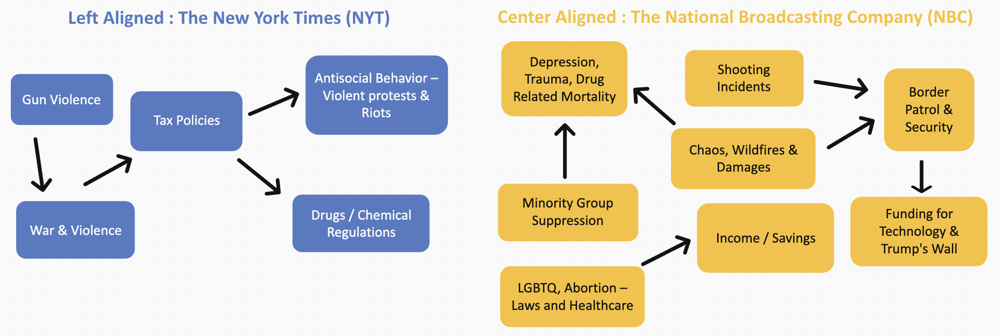

## Intro
Political polarization is an important feature of modern-day mainstream media news. We are interested in understanding whether media outlets with different political leanings propagate different causal narratives while discussing the same set of events. For example, a left-leaning media outlet narrative could be that "gun control laws" cause "gun violence", while a right-leaning media outlet could say that  "mental health issues" cause "gun violence". A proper understanding of how polarization works in politics is key in aiding further policy intervention. To our best knowledge, there hasn't been any existing work done on automatically and efficiently extracting and visualizing these causal narratives in news articles. After exhaustive research, we have broken down this task into three realizable Data Science problems. This paper presents to you a generic Data Science pipeline that can be applied to any domain and also the final results of Causal Narratives from New York Times (left aligned) and NBC (center aligned) for the year 2019

## Data

We applied our designed pipeline on the POLUSA dataset collected and cleaned in \citealp{polusa}. This dataset is appointed by the mentors. It contains 0.9 million news articles in English that covers policy topics, over a span of two and a half years (2017-2019) from 18 major news outlets in the United States. Articles are extracted from an online archive, and most often contain around 500 to 1000 characters, which translates to about 30 to 50 sentences. Both exact- and near-duplicated articles are removed. Media outlets are labeled with their political leanings, including left, central, right, or undefined, and the number of articles from each media outlets is balanced according to its popularity. The political leaning labels are necessary for analyzing how political polarization affects causal narratives. Table 1 shows a shortened example from the dataset. (Only columns relevant to our current application and the first sentence of body text are shown for illustrative purpose) One drawback of this dataset is that it is not constructed specifically for causal analysis purposes, so the dataset does not contain causal relation labels that can be used in evaluation, and because of this we could not fine-tune any of the models on this data. 

## Method
### Mining Causal Pairs
Causal Pairs Mining is a 3 step approach:

    - Causal Sequence Classification (CSC) : Machine Learning Classification problem that returns 0/1 depending on if input contains causal relations
    - Cause-Effect Span Detection (CESD) : Machine Learning Sequence Tagging problem that identifies the spanning tokens/words that form the cause and effect arguments in a sequence that contains causal relation
    - Causal Pair Classification (CPC) : Machine Learning classification task that takes a sequence with marked cause and effect arguments, and verifies if the marked cause argument causes the effect argument

Note that CSC and CESD, when consolidated together, equates to an end-to-end causal relation extraction from text. From experiments, we identify that current LLMs perform relatively poorly on CESD compared to CSC and CPC, and have very good performance on CPC across several benchmark datasets. Inspired by UniCausal, we decide to implement causal extraction doing CSC and CESD sequentially, mark back the resulting cause-effect pairs to original sentences, and in the end perform CPC to further distil results.

### Topic Modeling
We feed both arguments' phrase embeddings and their original sequence embeddings to train a Phrase-BERT based topic model on all of the extracted arguments, regardless of causes or effects, and use the trained model to cluster each argument into $n$ clusters. The trained model is expected to learn $n$ topic embeddings through contrastive learning on sequence embeddings, and match each argument to the nearest neighbored topic based on its phrase-bert based embedding and the topic embeddings generated. Topic names can be labelled either through manually summarizing the set of clustered arguments, matching topic embeddings to the nearest Phrase-BERT based embeddings of a pre-defined list of vocabulary, or implementing another language model to generate event phrases through summarizaiton. In this project we mainly use manual labelling, and lightly test prompt-based approach with GPT-3.

### Causal Graph Discovery
Data curated from previous steps include cause-effect pairs with their corresponding topic labels, indicating an occurrence of causal relation from cause-topic to effect-topic. By combining all cause-effect topic pairs, a matrix can be constructed from the total number of occurrences of causal relations from each topic to each other topics. This is then an observational quantitative data that theoretically can be used to generate causal graphs. 

## File Details
Code for causal narratives project

Insturctions for preprocessing data and running model is inside 100 folder.

PhraseBERT training is inside corresponding jupyter notebooks in 200 folder.

Causal Graph generation is inside corresponding jupyter notebooks in 300 folder.
